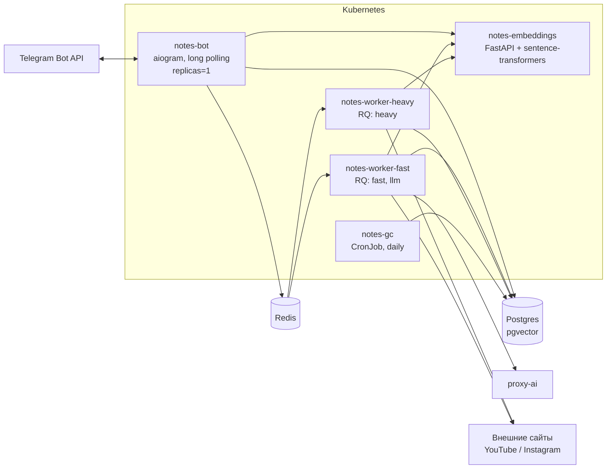

# 01. Контекст и компоненты

## Акторы

| Актор | Взаимодействие |
|---|---|
| Пользователь в личном чате | Шлёт заметки, выбирает приватность, ищет, редактирует, удаляет |
| Участник группы-"комнаты" | Шлёт заметки в общий скоуп, ищет внутри группы |
| Оператор | Деплой, миграции, ротация секретов, разбор `status='failed'` |

## Внешние зависимости

| Зависимость | Роль | Владелец | Риск отказа |
|---|---|---|---|
| Telegram Bot API | Транспорт | Внешний | Полный отказ приёма и выдачи |
| Postgres + pgvector | Хранилище заметок и векторов | Существующий family-bot | Полный отказ |
| Redis | Очередь RQ, состояние поиска, FSM | Существующий | Приём деградирует до синхронного, поиск теряет пагинацию |
| proxy-ai | Генеративный LLM | Внутренний, контракт не зафиксирован | Деградация: заметки сохраняются без заголовка и тегов |
| Целевые сайты, YouTube, Instagram | Источники контента | Внешние | Заметка сохраняется как ссылка без извлечённого текста |

Единственные жёсткие зависимости - Telegram и Postgres. Всё остальное
проектируется так, чтобы отказ приводил к деградации, а не к потере заметки.

## Компоненты



### notes-bot

Единственный компонент, говорящий с Telegram. Обязанности:

- приём апдейтов (long polling), роутинг команд и callback-кнопок;
- запись заметки в БД со статусом `pending` и постановка задачи в очередь;
- рендер выдачи поиска и клавиатур;
- синхронный путь поиска: эмбеддинг запроса, SQL, отрисовка.

Бот не выполняет сетевых загрузок контента и не вызывает LLM в фоне. Всё
долгое уходит в очередь. Исключение - `/smart_search`, где пользователь
осознанно ждёт; этот вызов идёт с таймаутом и индикацией "печатает".

Реплик строго одна: два процесса `getUpdates` на одном токене конфликтуют.
Стратегия обновления `Recreate`.

### notes-worker-fast

RQ-воркер на очередях `fast` и `llm`. Обрабатывает то, что не требует
скачивания медиа: чистый текст, извлечение текста страницы через
`trafilatura`, резолв редиректа для карт, чанкинг, эмбеддинг, а также все
задачи обогащения через proxy-ai. Лёгкий образ без ffmpeg и torch-стека
для Whisper.

### notes-worker-heavy

RQ-воркер на очереди `heavy`. Скачивание через `yt-dlp`, извлечение аудио
через ffmpeg, транскрибация через `faster-whisper`. Отдельный деплоймент,
потому что профиль нагрузки принципиально другой: минуты CPU и гигабайты
RAM на задачу. Смешивание с `fast` привело бы к тому, что сохранение
обычного текста ждёт окончания транскрипции.

### notes-embeddings

FastAPI-сервис, единственный владелец embedding-модели. Инкапсулирует
специфику модели: префиксы `query:` / `passage:` для e5, нормализацию
векторов, батчинг, ограничение конкурентности. Приложение знает только
"дай вектор для текста в роли запроса или пассажа".

Выделен в отдельный сервис по трём причинам: модель весит порядка гигабайта
и не должна грузиться в каждый под; смена модели не требует пересборки
приложения; бот и оба воркера используют один и тот же экземпляр.

### notes-gc

CronJob раз в сутки. Hard-delete заметок с `deleted_at` старше 30 дней,
чанки уходят каскадом. Дополнительно: перевод зависших `processing` заметок
обратно в `pending` и метрика по `failed`.

## Структура репозитория

```
bot-notes/
├── docs/
│   ├── design/notes-bot-design.md      # исходный дизайн-док
│   └── architecture/                   # этот набор
├── src/notes_bot/
│   ├── config.py                       # pydantic-settings
│   ├── db/                             # engine, модели, репозитории
│   ├── domain/                         # чистая логика: ACL, чанкинг, ранжирование
│   ├── extractors/                     # text, page, youtube, instagram, map
│   ├── clients/                        # embeddings, proxy-ai, telegram helpers
│   ├── queue/                          # определения очередей и задач RQ
│   ├── bot/                            # aiogram: handlers, keyboards, render
│   └── cli/                            # entrypoints: bot, worker, gc, import
├── services/embeddings/                # отдельный FastAPI-сервис
├── migrations/                         # alembic
├── deploy/k8s/
├── tests/
└── tools/import_telegram_export.py
```

`domain/` не импортирует aiogram, RQ и SQLAlchemy-сессии - только типы. Это
даёт возможность тестировать ACL-предикаты, чанкинг и ранжирование без
инфраструктуры.
