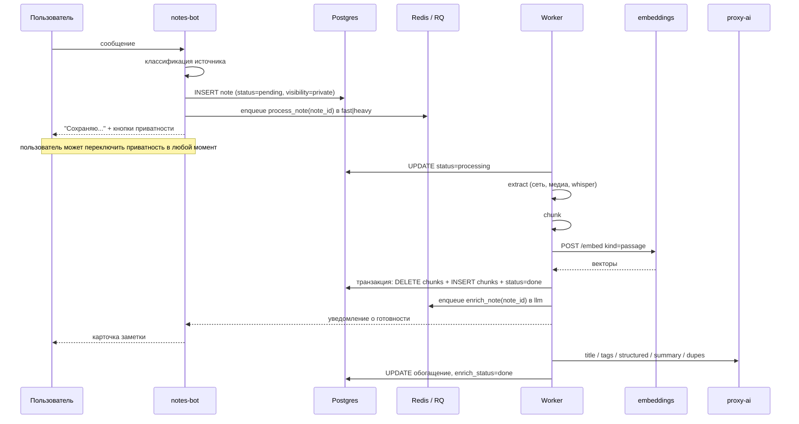

# 03. Пайплайн приёма заметки

## Общий поток



Ключевое: заметка попадает в БД до начала обработки. Если воркер упадёт, сеть
отвалится или Whisper не справится - у пользователя всё равно сохранён
исходный текст или ссылка. Потеря данных из-за отказа внешнего сервиса
исключена по построению.

## Шаг 1. Классификация источника

Выполняется в боте, синхронно, без сети.

```
есть URL в тексте?
├── нет                                       → text
└── да, берём первый URL
    ├── host ∈ {youtube.com, youtu.be, m.youtube.com}      → youtube
    ├── host ∈ {instagram.com, www.instagram.com}          → instagram
    ├── host ∈ короткие ссылки карт
    │        {maps.app.goo.gl, goo.gl/maps, maps.google.*}  → map
    └── иначе                                               → page
```

Если в сообщении есть и URL, и собственный текст пользователя, сохраняется и
то и другое: URL в `source_url`, весь текст сообщения в `raw_text`. В индекс
пойдут оба - комментарий пользователя часто содержательнее автоизвлечённого
текста.

Прочие ссылки внутри описаний постов и видео не обходятся - остаются текстом
внутри заметки, как задано дизайн-доком.

## Шаг 2. Приём в боте

```
1. Проверить, надо ли вообще сохранять (для групп - capture_mode, ADR-10)
2. INSERT ... ON CONFLICT (chat_id, tg_message_id) DO NOTHING RETURNING id
   - конфликт означает повторную доставку, ничего не делаем
3. Для личного чата: visibility = user_settings.default_visibility (дефолт 'private')
   Для группы: visibility = NULL
4. Выбрать очередь: instagram → heavy, всё остальное → fast
5. enqueue с job_id = f"note:{note_id}" - защита от двойной постановки
6. Ответить пользователю сразу, не дожидаясь обработки
```

Ответ бота в личном чате содержит инлайн-кнопки `🔒 приватная` /
`🌐 публичная`. Кнопка это переключатель уже проставленного значения, а не
блокирующий шаг: обработка идёт параллельно, пока пользователь думает.
Переключение приватности не трогает чанки и векторы - это `UPDATE` одной
колонки.

## Шаг 3. Экстракторы

Единый интерфейс:

```python
class Extractor(Protocol):
    source_type: str
    queue: Literal["fast", "heavy"]

    async def extract(self, note: Note) -> ExtractResult: ...

@dataclass
class ExtractResult:
    text: str                 # то, что пойдёт в extracted_text
    title: str | None         # техническое название из источника, не LLM-заголовок
    lang: str | None
    meta: dict                # длительность, автор, наличие субтитров и т.п.
```

| Тип | Инструмент | Что делает | Очередь |
|---|---|---|---|
| `text` | - | Возвращает пустой результат, индексируется `raw_text` | fast |
| `page` | `trafilatura` | Забирает страницу через SSRF-safe фетчер, извлекает основной текст | fast |
| `youtube` | `yt-dlp` (metadata-only) + `youtube-transcript-api` | Заголовок, описание, субтитры при наличии. Распознавание речи не применяется | fast |
| `instagram` | `yt-dlp` + ffmpeg + `faster-whisper` | Caption поста, затем аудиодорожка, затем транскрипт. Конкатенация обоих | heavy |
| `map` | HTTP HEAD/GET без тела | Следует за редиректом, из финального URL достаёт имя места. Страница не скрапится | fast |

### SSRF-safe фетчер

Пользователь диктует URL, а бот живёт внутри кластера. Без защиты бот
превращается в инструмент разведки внутренней сети. Обязательные меры для
всех исходящих запросов по пользовательским URL:

- разрешены только схемы `http` и `https`;
- DNS резолвится заранее, адрес проверяется против блок-листа: loopback,
  link-local (`169.254.0.0/16`, включая `169.254.169.254`), RFC1918,
  `::1`, unique-local IPv6, метаданные облака;
- соединение идёт на проверенный IP с явным `Host`-заголовком - иначе DNS
  можно перепривязать между проверкой и запросом;
- каждый редирект проверяется заново, максимум 5 переходов;
- таймаут на соединение и на общую длительность;
- жёсткий лимит размера тела, чтение потоком с обрывом по превышению;
- ограничение Content-Type для `page` (`text/html`, `text/plain`).

Тот же фетчер используется резолвером карт.

### Ограничения тяжёлого пути

| Параметр | Значение | Причина |
|---|---|---|
| Максимальный размер загрузки | 100 МБ | Диск пода и время |
| Максимальная длительность аудио | 20 минут | CPU-время Whisper |
| Таймаут задачи `heavy` | 30 минут | Не держать воркер вечно |
| Модель Whisper | `small`, `compute_type=int8` | CPU-only, компромисс скорость/качество |
| Временные файлы | `emptyDir`, удаление в `finally` | Под может перезапуститься |

Транскрибация на CPU заметно медленнее реального времени (это моё
предположение - точный множитель зависит от конкретного узла и требует
замера на первом же проде). Если замер покажет неприемлемое время, варианты
по убыванию предпочтительности: модель `base` вместо `small`, ограничение
длительности до 10 минут, отключение транскрипции для длинных постов с
пометкой в карточке заметки.

### Деградация

Экстрактор упал или вернул пустоту - это не провал заметки:

```
extract() успешен и текст непустой  → extracted_text = результат
extract() упал или текст пустой     → extracted_text = NULL,
                                      error = краткая причина,
                                      индексируем raw_text (текст + URL)
                                      status = 'done', а не 'failed'
```

`status='failed'` ставится только если не удалось даже посчитать эмбеддинг
для `raw_text` - то есть заметку физически нельзя найти. Пользователю в этом
случае приходит сообщение с возможностью повтора.

## Шаг 4. Чанкинг

```
1. Нормализация: схлопывание пробелов, удаление служебных таймкодов субтитров,
   удаление повторяющихся строк (типично для автосубтитров YouTube)
2. Разбиение по абзацам, затем по предложениям
3. Сборка чанков до целевого размера в токенах с перекрытием
4. Отбрасывание чанков короче минимального порога, кроме случая
   "у заметки всего один чанк"
```

Параметры:

| Параметр | Значение | Обоснование |
|---|---|---|
| Целевой размер чанка | 400 токенов | Помещается в контекст обеих моделей-кандидатов |
| Перекрытие | 60 токенов | Мысль на границе чанков не теряется |
| Минимальный чанк | 40 токенов | Обрывки дают шумные векторы |
| Максимум чанков на заметку | 200 | Защита от часового транскрипта |

Токенизация выполняется тем же токенайзером, что и у активной модели, -
`embeddings` отдаёт его имя через `GET /model`. Считать чанки в символах
нельзя: для иврита и кириллицы соотношение символов к токенам сильно
отличается от английского.

Отдельное замечание по выбору модели: у `paraphrase-multilingual-mpnet-base-v2`
длина входа заметно меньше, чем у `intfloat/multilingual-e5-base` (это моё
предположение, нужно проверить по `max_seq_length` при бенчмарке на M1).
Если оно подтвердится, целевой размер чанка придётся опустить под первую
модель или выбрать вторую. Это входит в план замера на этапе M1.

## Шаг 5. Эмбеддинг и запись

```python
# в одной транзакции
DELETE FROM note_chunks WHERE note_id = :id;
INSERT INTO note_chunks (note_id, chunk_index, chunk_text, token_count,
                         embedding, embedding_model)
VALUES ...;
UPDATE notes SET status='done', extracted_text=..., lang=..., updated_at=now()
WHERE id = :id;
```

Вызов embedding-сервиса идёт до открытия транзакции - сеть не должна
удерживать блокировки. Батч ограничен по количеству текстов и по суммарной
длине.

## Шаг 6. Обогащение через proxy-ai

Отдельная задача в очереди `llm`, отдельный статус. Никогда не блокирует
`status='done'`: заметка находится поиском ещё до появления тегов.

| Фича | Вход | Выход |
|---|---|---|
| Заголовок | Первые ~1500 токенов текста | `notes.title` |
| Автотеги | То же | `notes.tags` |
| Структурные поля для мест | Текст + признак `source_type='map'` или геомаркеры | `notes.structured` |
| Суммаризация | Полный текст, если он длиннее порога | `notes.summary` |
| Детекция дублей | Кандидаты, найденные векторным поиском среди своих заметок | Уведомление пользователю |

Детекция дублей построена двухфазно: сначала дешёвый векторный поиск по
заметкам того же владельца отбирает несколько ближайших, и только они
отправляются в LLM на подтверждение. Прогонять через LLM все заметки
нереально.

При недоступности proxy-ai задача ретраится с экспоненциальной задержкой,
после исчерпания попыток - `enrich_status='failed'`. Заметка остаётся
полностью рабочей, просто без заголовка и тегов; их можно догенерировать
позже повторным прогоном.

## Редактирование

Разрешено только для `source_type='text'`.

```
Текст:
  пользователь присылает новое сообщение как замену
  → UPDATE notes SET raw_text=..., status='pending', updated_at=now()
  → enqueue process_note → полный ре-чанкинг и ре-эмбеддинг
  → enqueue enrich_note  → перегенерация тегов и заголовка

Приватность:
  → UPDATE notes SET visibility=... - мгновенно, векторы не трогаются
```

Во время ре-обработки заметка временно уходит из выдачи (`status != 'done'`).
Это осознанный компромисс в пользу того, чтобы не показывать текст, не
соответствующий векторам.

## Удаление и восстановление

```
/list или кнопка в выдаче → подтверждение (Да / Отмена)
  → UPDATE notes SET deleted_at = now() WHERE id=:id AND user_id=:me AND deleted_at IS NULL
/trash → список своих удалённых
  → ♻️ → UPDATE notes SET deleted_at = NULL WHERE id=:id AND user_id=:me
```

`user_id = :me` стоит прямо в `WHERE`, а не проверяется отдельным `SELECT`.
Проверка права и изменение - одна операция, состояния гонки нет. Ноль
затронутых строк означает отказ в доступе.

Hard-delete - CronJob:

```sql
DELETE FROM notes
WHERE deleted_at IS NOT NULL
  AND deleted_at < now() - interval '30 days';
```

Удаление пачками по несколько тысяч строк, чтобы не держать длинную
транзакцию на общем инстансе Postgres. Чанки уходят каскадом.

## Импорт экспорта Telegram

Bot API не даёт истории до момента добавления бота - это ограничение
платформы. Одноразовый скрипт `tools/import_telegram_export.py`:

```
result.json (Telegram Desktop export)
  → для каждого текстового сообщения:
      определить user_id по маппингу из экспорта
      INSERT note (tg_message_id = NULL, created_at = дата из экспорта,
                   chat_id = целевая группа, is_group = true)
      enqueue process_note
  → прогресс и отчёт по пропущенным
```

`tg_message_id = NULL` сознательно: id из экспорта не совпадают с теми, что
бот увидит позже, и уникальный индекс на них ставить нельзя. Защита от
повторного импорта - отдельный ключ идемпотентности в `structured`
(`{"import_id": "..."}`) и проверка перед вставкой.
