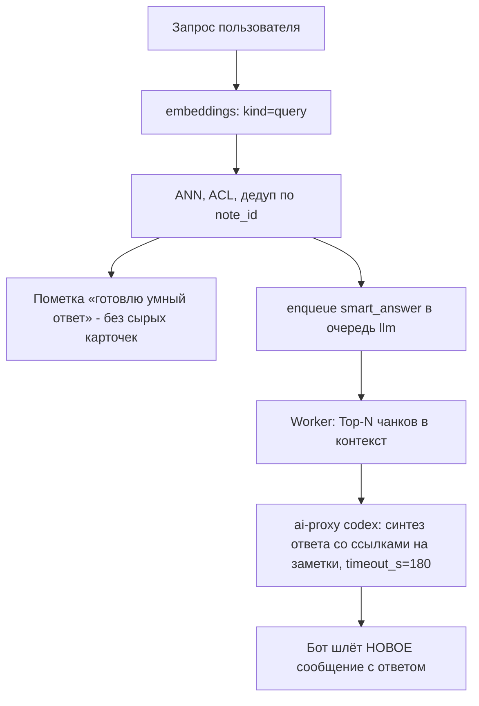

# 04. Поиск

## Проблема в запросе из дизайн-дока

Запрос, приведённый в дизайн-доке, возвращает неверно отсортированный
результат:

```sql
SELECT DISTINCT ON (n.id) ..., nc.embedding <=> :query_vector AS distance
FROM note_chunks nc JOIN notes n ON n.id = nc.note_id
WHERE <acl>
ORDER BY n.id, distance
LIMIT 6 OFFSET :offset;
```

`DISTINCT ON (n.id)` требует, чтобы `ORDER BY` начинался с `n.id`. Поэтому
`LIMIT 6 OFFSET :offset` применяется к результату, отсортированному по
идентификатору заметки, а не по релевантности. Пользователь получит шесть
заметок с наименьшими `id` среди подходящих, а не шесть самых близких.
Пагинация при этом будет листать заметки по возрастанию `id`.

Второй эффект: `ORDER BY n.id` не даёт использовать HNSW-индекс, так что
расстояние считается для всех чанков во всех подходящих заметках.

Исправление - вынести дедупликацию в подзапрос и сортировать по расстоянию
снаружи.

## Целевой запрос

```sql
WITH ann AS (
    -- Фаза 1: приближённый отбор кандидатов по чанкам.
    -- Единственное место, где считается расстояние.
    SELECT nc.note_id,
           nc.chunk_text,
           nc.embedding <=> :query_vector AS distance
    FROM note_chunks nc
    JOIN notes n ON n.id = nc.note_id
    WHERE n.deleted_at IS NULL
      AND n.status = 'done'
      AND nc.embedding_model = :active_model
      AND ( /* ACL-предикат, см. ниже */ )
    ORDER BY nc.embedding <=> :query_vector
    LIMIT :candidate_k          -- 200
),
best AS (
    -- Фаза 2: лучший чанк на заметку
    SELECT DISTINCT ON (note_id) note_id, chunk_text, distance
    FROM ann
    ORDER BY note_id, distance
)
-- Фаза 3: ранжирование по релевантности и страница
SELECT n.id, n.title, n.source_url, n.source_type, n.tags,
       b.chunk_text, b.distance
FROM best b
JOIN notes n ON n.id = b.note_id
ORDER BY b.distance
LIMIT :page_size + 1 OFFSET :offset;
```

`LIMIT :page_size + 1` - приём из дизайн-дока: берём на одну запись больше,
чем показываем, чтобы понять, есть ли следующая страница. Показываем 5,
запрашиваем 6.

`candidate_k = 200` - компромисс: достаточно, чтобы после схлопывания по
заметкам осталось заметно больше страницы, и достаточно мало, чтобы фаза 2
была дешёвой.

`max_distance` (`SEARCH_MAX_DISTANCE`, по умолчанию 0.20) - фаза 3 дополнительно
отбрасывает всё с `distance > max_distance`. Без этого порога поиск всегда
возвращает до `limit` результатов, даже если релевантных нет вовсе - особенно
заметно при маленьком корпусе, где топ-N по расстоянию это буквально все
заметки пользователя. Для коротких текстов заметок
`intfloat/multilingual-e5-base` сжимает distance в узкий диапазон
независимо от темы, так что число пересматривалось уже трижды на реальных
примерах:

- 0.5, потом 0.25 - обе занижены: запрос "порекомендуй уличную еду в
  тбилиси" дал 0.145 к релевантному видео, но 0.206-0.221 к не связанным
  заметкам про покупки;
- 0.18 (следующее значение) уложилось в этот зазор, но оказалось уже
  завышено в другую сторону: заметка на иврите "5 лучших веломаршрутов в
  Тель-Авиве" для запроса "где велодорожки" легла на distance=0.197 - чуть
  выше порога - а следующий по близости кандидат (не по теме: пляжи возле
  Хайфы) был на 0.207;
- 0.20 - единственное значение, удовлетворяющее обоим примерам разом
  (>0.197, <0.206).

Абсолютный порог - грубый инструмент для настолько сжатой модели;
относительный порог (держать хиты в пределах дельты от distance лучшего
результата, а не от фиксированного потолка) подстроился бы под это
автоматически - стоит перейти на него, когда накопится достаточно
реального трафика поиска, вместо повторной ручной подгонки этого числа
на каждый новый противоречащий пример.

### Debug: почему поиск ничего не нашёл

Ручная подгонка `max_distance` выше требует видеть реальные distance, а не
только "ничего не найдено". Когда `/search` или `/smart_search` не находят
ничего и у вызвавшего включён `/debug` (03-ingest.md), следом приходит
отдельное сообщение с ближайшими кандидатами из фазы 1 - теми, что не
прошли порог - и их distance (`render.render_search_debug_empty`). Без
`/debug` это сообщение не отправляется: обычный пользователь видит только
"ничего не найдено".

Технически: фаза 3 фильтрует `max_distance` в Python, не в SQL (`SearchHit`
с полным списком кандидатов уже есть в памяти к этому моменту) - отдельного
запроса к базе для debug-сообщения не требуется.

## ACL-предикаты

Три сценария из дизайн-дока, слово в слово по семантике:

```sql
-- 1. Поиск из группы: строго внутри группы
n.chat_id = :current_chat_id

-- 2. Поиск из личного чата, режим 'all' (по умолчанию)
(   n.user_id = :current_user_id
 OR (n.visibility = 'public' AND n.is_group = false) )

-- 3. Поиск из личного чата, режим 'mine_only'
n.user_id = :current_user_id
```

Следствия, которые стоит держать в голове:

- Заметка, отправленная пользователем в группу, видна ему же в личном поиске
  через ветку `user_id = :current_user_id`, но не видна другим людям вне
  группы. Это ровно то поведение, что задано дизайн-доком.
- Публичная заметка из личного чата видна всем в режиме `all`, но публичность
  групповых заметок наружу не распространяется (`is_group = false` в условии).
- Режим переключается командами `/search_mine` и `/search_all`, хранится в
  `user_settings.search_mode`.

Предикаты живут в одном месте - `domain/acl.py` - и покрываются табличными
тестами на матрице `(автор, чат, visibility, is_group, режим)`. Это единственная
часть системы, ошибка в которой означает утечку приватных заметок, поэтому
она вынесена из SQL-строк в отдельный тестируемый модуль.

## Про ANN-индекс и фильтрацию

Фильтр по ACL применяется к тем же строкам, по которым идёт ANN-поиск. При
таком плане Postgres может выбрать точный скан вместо HNSW, особенно если
селективность фильтра высока. На старте это не проблема: при объёме порядка
десятков тысяч чанков точный скан занимает десятки миллисекунд и даёт
стопроцентную полноту (это моё предположение по порядку величины - точные
цифры надо померить на реальных данных).

Когда объём вырастет и HNSW начнёт применяться, появится известный эффект
пост-фильтрации: индекс вернёт `ef_search` ближайших, после чего ACL отсечёт
часть, и результатов может оказаться меньше `candidate_k`. Подготовленные
меры, по возрастанию сложности:

1. Поднять `hnsw.ef_search` для поисковых запросов.
2. Включить итеративный скан индекса, если версия pgvector его поддерживает
   (почти точно доступно в 0.8 и новее - проверить версию на существующем
   инстансе).
3. Денормализовать ACL-поля (`user_id`, `chat_id`, `is_group`, `visibility`,
   `deleted_at`) в `note_chunks`, чтобы фильтр работал по одной таблице.
   Цена - обновление чанков при переключении приватности и при мягком
   удалении. Это подготовленный, но не выполняемый на старте шаг.

## Пагинация

Дизайн-док предлагает хранить в Redis сам вектор запроса и смещение. Вектор
хранить не обязательно и нежелательно: повторный ANN на каждую страницу
может дать другой порядок, и пользователь увидит дубли или пропуски между
страницами. Вместо этого кешируется готовый ранжированный список заметок.

```
key:   notes:search:{user_id}:{session_id}
ttl:   30 минут
value: {
  "query": "исходный текст запроса",
  "mode": "all",
  "scope_chat_id": null,
  "note_ids": [812, 77, 940, ...],   // до 50, в порядке релевантности
  "offset": 5,
  "created_at": "2026-09-13T10:00:00Z"
}
```

Кнопка «Показать ещё 5» берёт следующий срез `note_ids`, подгружает свежие
поля заметок из Postgres по этим id и отправляет **новое** сообщение, не
редактируя старое. Предыдущие результаты остаются в чате, отдельная кнопка
«Назад» не нужна - как и задумано в дизайн-доке.

Подгрузка полей из Postgres на каждой странице, а не кеширование текста в
Redis, нужна для того, чтобы удалённая между страницами заметка не всплыла в
выдаче: при выборке проверяется `deleted_at IS NULL` и ACL заново.

`session_id` - короткий случайный идентификатор, попадающий в `callback_data`
кнопки. Истёкший ключ означает ответ «поиск устарел, повторите запрос».

## Команды поиска

| Команда | Поведение | LLM |
|---|---|---|
| `/search <запрос>` или просто текст в режиме поиска | Чистый векторный поиск, запрос как есть | нет |
| `/smart_search <запрос>` | Сразу отдаёт пометку «готовлю ответ»; сам синтезированный ответ приходит отдельным сообщением асинхронно - сырые карточки заметок не показываются | да, асинхронно |
| `/list` | Свои заметки по дате, без векторов | нет |
| `/trash` | Свои удалённые, восстановление | нет |
| `/search_mine`, `/search_all` | Переключение `user_settings.search_mode` | нет |

`/search` остаётся быстрым, как и требует дизайн-док: один вызов эмбеддинга
запроса плюс один SQL.

## /smart_search

Провайдер ai-proxy для генерации - codex через Codex CLI. Это CLI-провайдер:
дефолтный таймаут 300 секунд, реальный ответ - секунды-минуты, порядок величины
несовместим с синхронным ожиданием в чате. Поэтому `/smart_search` асинхронный:



Логика:

- поиск (ANN, ACL, дедуп) отрабатывает синхронно, но пользователю не
  показывается - только пометка «готовлю ответ» вместо сырых карточек: у
  `/smart_search` нет смысла показывать необработанную выдачу, если сразу
  следом придёт разобранный ответ по тем же заметкам;
- если синхронный поиск вообще ничего не нашёл, `smart_answer` в очередь не
  ставится - пользователь получает обычное «ничего не найдено» сразу, без
  пометки «готовлю ответ», за которой ничего не следует;
- синтез ответа выносится в очередь `llm` (задача `smart_answer`), один вызов
  ai-proxy с `timeout_s=180`; переписывание запроса не делается - это сэкономило
  бы один LLM-вызов из двух, но удвоило бы задержку и стоимость на CLI-провайдере;
- готовый ответ приходит **новым сообщением** в тот же чат; на время работы
  задачи бот шлёт `sendChatAction: typing`;
- любая ошибка ai-proxy (`503 quota_exhausted`, `504 timeout`, `5xx`), сбой
  эмбеддинга запроса или пустой синтез отправляют пользователю сообщение о
  неудаче вместо тишины после пометки «готовлю ответ» - раньше сбой можно
  было просто залогировать, потому что обычная выдача уже была на экране,
  теперь пометка «готовлю ответ» - единственное, что видел пользователь, и
  без явного ответа об ошибке она выглядела бы как повисший запрос;
- если `LLM_ENABLED=false`, синтеза вообще не будет - в этом случае
  `/smart_search` показывает сырые карточки как раньше, иначе на запрос не
  приходило бы вообще никакого ответа;
- ACL применяется на шаге C, в SQL, до попадания текста в контекст LLM. Чужой
  приватный текст не может утечь в промпт.

Последний пункт важен: единственный способ, которым приватная заметка может
покинуть систему, - попадание в контекст LLM-запроса. Поэтому фильтрация
выполняется в SQL, а не после получения результатов.

Синхронный вариант с жёстким коротким `timeout_s` рассматривался и отвергнут:
на CLI-провайдере он почти всегда падал бы в таймаут и деградировал до
`/search`, то есть умный режим фактически не работал бы.

## Рендер выдачи

`/search` (и пагинация `/search` через «Показать ещё») по умолчанию отдаёт
короткую карточку на заметку, а не полную - как у Google, сниппет вместо
всего документа:

```
{иконка типа} {title или первые 60 символов текста}
{summary заметки, если он есть; иначе фрагмент лучшего чанка, до 120 символов}
[Подробнее]
```

`summary` берётся из `notes.summary` (`enrich_note`, см. 03-ingest.md, "Шаг
6") - есть не у каждой заметки: только когда `LLM_ENABLED=true` и текст
длиннее порога суммаризации. Без него - тот же укороченный фрагмент, что и
в полной карточке, просто короче (120 символов вместо 200).

Кнопка «Подробнее» (`detail:{session_id}:{note_id}`) разворачивает эту же
заметку в полную карточку:

```
{иконка типа} {title или первые 60 символов текста}
{фрагмент лучшего чанка, до 200 символов}
{#тег1 #тег2 #тег3}
{ссылка на источник, если есть}
{📍 места из видео, если есть - см. 03-ingest.md, "Места из видео"}
[🗑 удалить]   ← только если notes.user_id = текущий пользователь
```

Кнопка «Подробнее» переиспользует тот же `SearchSessionCache`, что и
пагинация - `note_id` из callback_data должен реально быть частью
исходного результата этого поиска (иначе `show_detail` возвращает `None`,
попытка обратиться к чужому note_id по подобранному callback_data ничего не
даёт), и ACL перепроверяется в момент нажатия, а не берётся из снимка
исходного поиска - заметка могла стать приватной за это время.

Кнопка удаления рендерится только владельцу. Это удобство, а не защита:
настоящая проверка стоит в `WHERE` запроса удаления.
